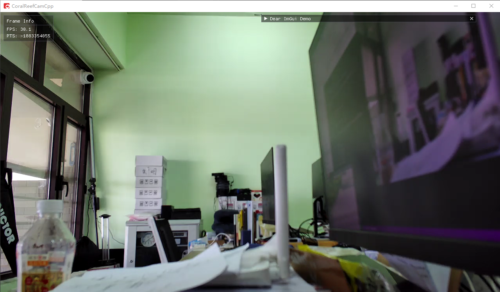

# CoralReefCamCpp

珊瑚礁™嘻屁屁高性能版，是 CoralReefPlayer 的示例项目，并集成了 SDL、imgui、OpenCV 等库，可基于此项目开发高性能机器人上位机。目前作为监控软件使用，其最初的开发目的是用于解决拉流延迟问题。

CoralReefPlayer 即珊瑚礁播放器，是一款使用 C++20 开发的跨平台流媒体播放器库，可为水下机器人上位机提供可定制、高性能、低延迟的推拉流、编解码及录像能力。

CoralReefPlayer 支持 Windows、Linux、MacOS、Android 和 iOS 等主流操作系统，并且提供 C#、Java 和 Python 等语言的 binding，方便使用各种语言和框架开发上位机。



## 依赖

随源码自带或推荐使用的第三方库版本如下所示，括号内为最低版本要求：
- CoralReefCam
    - CoralReefPlayer
        - live555 2023.07.24
        - FFmpeg 4.4 (4.4+)
    - SDL2 2.28.1 (2.26.0+)
    - imgui 1.89.5
    - implot 0.16
    - （可选）OpenCV 4.7.0 (4.4.0+)
        
## 编译指南

### Windows

前置条件:
- Visual Studio 2019 或以上版本，需要启用 `使用 C++ 的桌面开发`
- （可选）下载预编译的 OpenCV 库至 opencv 或任意目录中

编译步骤:
1. 直接使用 VS 打开本仓库
2. 右键根目录下的 CMakeLists.txt，选择 `CMake 设置` 打开设置界面
3. 填写必要的配置项，然后进行生成
4. 享受 CoralReefCamCpp 吧

如果不想使用 ninja 构建，也可使用 cmake-gui 生成 VS 工程，然后用 VS 打开工程进行构建

### Linux

前置条件:
- CMake 3.16.0 或更高版本，推荐 3.21.0+
- gcc 11 或更高版本
- 使用包管理器或源码编译安装下列库或它们的更高版本：
    - FFmpeg 4.4+
    - SDL2 2.26.0+
    - （可选）OpenCV 4.4.0+

编译步骤:
1. 使用终端进入本仓库根目录
2. 使用 `cmake-gui` 或 `ccmake` 配置项目，然后进行生成
3. 进入构建目录，执行 `make -j8` 进行构建
4. 执行 `make install` 安装至指定目录
5. 享受 CoralReefCamCpp 吧

### Other

其他系统正在适配中，欢迎提交 PR

## 文档

CoralReefPlayer 总体架构图：TODO

CoralReefPlayer API 文档：

```c
// coralreefplayer.h

/**
 * @brief 创建播放器
 * @return 播放器句柄
 */
crp_handle crp_create();

/**
 * @brief 销毁播放器，会自动停止播放
 * @param handle 播放器句柄
 */
void crp_destroy(crp_handle handle);

/**
 * @brief 开始播放指定 RTSP 流，仅支持 H264 码流，暂时不支持音频
 * @param handle 播放器句柄
 * @param url RTSP 流地址
 * @param transport 传输协议
 * @param width 解码图像宽度，CRP_WIDTH_AUTO 为从码流自动获取
 * @param height 解码图像高度，CRP_HEIGHT_AUTO 为从码流自动获取
 * @param format 解码图像格式
 * @param callback 图像帧回调函数
 */
void crp_play(crp_handle handle, const char* url, Transport transport,
    int width, int height, Format format, crp_callback callback);
```

## 版权声明

本项目除使用的第三方库外所有代码均为自研，版权由大连理工大学 OurEDA 实验室所有。

除 CoralReefCam 和 API 接口外的代码仅限在 OurEDA 实验室内网传播，禁止上传至外网，产品应以去除 debug 信息的预编译库形式与 API 接口及文档一并提供给客户。
