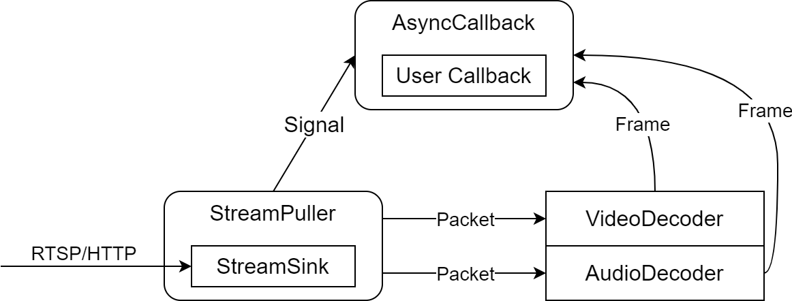

# CoralReefPlayer

CoralReefPlayer 即珊瑚礁播放器，是一款使用 C++20 开发的跨平台流媒体播放器库，可为水下机器人上位机提供可定制、高性能、低延迟的推拉流、编解码及录像能力。

CoralReefPlayer 支持 Windows、Linux、MacOS、Android 和 iOS 等主流操作系统，并且提供 C#、Java 和 Python 等语言的 binding，方便使用各种语言和框架开发上位机。

CoralReefCam，中文名珊瑚礁™嘻屁屁高性能版，是 CoralReefPlayer 的示例项目，集成了 SDL、imgui、OpenCV 等库，可基于此项目开发高性能机器人上位机。目前作为监控软件使用，其最初的开发目的是用于解决拉流延迟问题。


## 依赖

随源码自带或推荐使用的第三方库版本如下所示，括号内为最低版本要求：

- CoralReefCam
    - CoralReefPlayer
        - [live555](http://www.live555.com/liveMedia/) 2023.11.30
        - [cpp-httplib](https://github.com/yhirose/cpp-httplib) 0.15.3
        - [FFmpeg](https://ffmpeg.org/) 4.4 (4.4+)
    - [SDL2](https://libsdl.org/) 2.30.2 (2.26.0+)
    - [imgui](https://github.com/ocornut/imgui) 1.90.5
    - [implot](https://github.com/epezent/implot) 0.16
    - （可选）[OpenCV](https://opencv.org/) 4.7.0 (4.4.0+)

## 编译指南

### Windows

前置条件：

- Visual Studio 2019 或以上版本，需要启用 `使用 C++ 的桌面开发`
- （可选）下载预编译的 OpenCV 库至 opencv 或任意目录中

编译步骤：

1. 直接使用 VS 打开本仓库
2. 右键根目录下的 CMakeLists.txt，选择 `CMake 设置` 打开设置界面
3. 填写必要的配置项，然后进行生成
4. 享受 CoralReefCamCpp 吧

如果不想使用 ninja 构建，也可使用 cmake-gui 生成 VS 工程，然后用 VS 打开工程进行构建

### Linux

前置条件：

- CMake 3.21.0 或更高版本
- gcc 11 或更高版本
- 使用包管理器或源码编译安装下列库或它们的更高版本：
    - FFmpeg 4.4+
    - SDL2 2.26.0+
    - （可选）OpenCV 4.4.0+

编译步骤：

1. 使用终端进入本仓库根目录
2. 使用 `cmake-gui` 或 `ccmake` 配置项目，然后进行生成
3. 进入构建目录，执行 `make -j8` 进行构建
4. 执行 `make install` 安装至指定目录
5. 享受 CoralReefCamCpp 吧

### MacOS

前置条件：

- apple-clang 13.1.6 或更高版本
- 其余依赖同 Linux

编译步骤：同 Linux

### Android

前置条件：

- Android Studio
- SDK 33（最低要求 24）
- NDK 25.1.8937393
- CMake 3.22.1 或更高版本

编译步骤：

1. 使用 Android Studio 打开 Android 目录
2. 编译并运行 `app` 项目

### iOS

前置条件：

- Xcode 14.0 或更高版本
- iOS SDK 17.0（最低要求 14.0）
- CMake 3.21.0 或更高版本

编译步骤：

1. 进入 iOS 目录，执行 `prebuild.sh` 脚本
2. 使用 Xcode 打开 `CoralReefPlayer.xcodeproj`
3. 编译并运行 `Example` 目标

### 交叉编译

CoralReefPlayer 支持交叉编译，可使用 CMake 的工具链文件进行交叉编译，工具链文件的编写请参考 `cmake/toolchains/aarch64-linux-gnu.toolchain.cmake`。

可使用 `-DCMAKE_TOOLCHAIN_FILE=<工具链文件路径>` 参数或 `cmake-gui` 工具指定工具链文件，其余编译步骤同 Linux。

### Other

其他系统正在适配中，欢迎提交 PR

## 文档

CoralReefPlayer 总体架构图：



CoralReefPlayer API 文档：

```c
// coralreefplayer.h

struct Option
{
    int transport;          // 传输协议（仅 RTSP 有效），见 Transport 枚举定义
    struct
    {
        int width;          // 解码图像宽度，CRP_WIDTH_AUTO 为从码流自动获取
        int height;         // 解码图像高度，CRP_HEIGHT_AUTO 为从码流自动获取
        int format;         // 解码图像格式，见 Format 枚举定义
        char hw_device[32]; // 硬解码器名称，可取值请参考 ffmpeg 文档，为空则使用软解码器
    } video;
    bool enable_audio;      // 是否启用音频
    struct
    {
        int sample_rate;    // 解码音频采样率
        int channels;       // 解码音频声道数
        int format;         // 解码音频格式，见 Format 枚举定义
    } audio;
    int64_t timeout;        // 超时时间，单位为毫秒
};

struct Frame
{
    union
    {
        struct
        {
            int width;       // 图像宽度
            int height;      // 图像高度
        };
        struct
        {
            int sample_rate; // 采样率
            int channels;    // 声道数
        };
    };
    int format;              // 数据格式，见 Format 枚举定义
    uint8_t* data[4];        // 数据指针
    int stride[4];         // 数据跨度，即一行数据的字节数（由于内存对齐，可能大于图像宽度）
    uint64_t pts;            // 展示时间戳
};

/**
 * @brief 事件回调函数类型
 * @param event 事件类型，见 Event 枚举定义
 * @param data 事件数据，收到视频和音频数据时为 Frame 结构体指针，其他事件为 NULL
 * @param user_data crp_play 函数中传入的用户自定义数据
 */
typedef void (*crp_callback)(int event, void* data, void* user_data);

/**
 * @brief 创建播放器
 * @return 播放器句柄
 */
crp_handle crp_create();

/**
 * @brief 销毁播放器，会自动停止播放
 * @param handle 播放器句柄
 */
void crp_destroy(crp_handle handle);

/**
 * @brief 设置 RTSP/HTTP 认证
 * @param handle 播放器句柄
 * @param username 用户名
 * @param password 密码
 * @param is_md5 密码是否为 MD5，HTTP 认证时此参数无效
 */
void crp_auth(crp_handle handle, const char* username, const char* password, bool is_md5);

/**
 * @brief 开始播放指定 RTSP/HTTP 流，支持 H264/H265/MJPEG 和 AAC/OPUS/PCM 码流
 * @param handle 播放器句柄
 * @param url RTSP/HTTP 流地址
 * @param option 播放选项结构体指针，见 Option 结构体定义
 * @param callback 事件回调函数，函数签名见 crp_callback
 * @param user_data 用户自定义数据，会在调用回调时传入
 * @return 是否成功，若参数不正确则返回 false，其他错误会调用回调
 */
void crp_play(crp_handle handle, const char* url, const Option* option, crp_callback callback, void* user_data);

/**
 * @brief 重新播放之前播放的 RTSP/HTTP 流
 * @param handle 播放器句柄
 * @return 是否成功，若之前未播放过则返回 false，其他错误会调用回调
 */
bool crp_replay(crp_handle handle);

/**
 * @brief 停止播放指定 RTSP/HTTP 流
 * @param handle 播放器句柄
 */
void crp_stop(crp_handle handle);

/**
 * @brief 获取版本号
 */
int crp_version_code();

/**
 * @brief 获取版本号字符串
 */
const char* crp_version_str();
```

## 版权声明

本项目除使用的第三方库外所有代码均为自研，版权由大连理工大学 OurEDA 实验室所有。

除 CoralReefCam 和 API 接口外的代码仅限在 OurEDA 实验室内网传播，禁止上传至外网，产品应以去除 debug 信息的预编译库形式与 API 接口及文档一并提供给客户。
